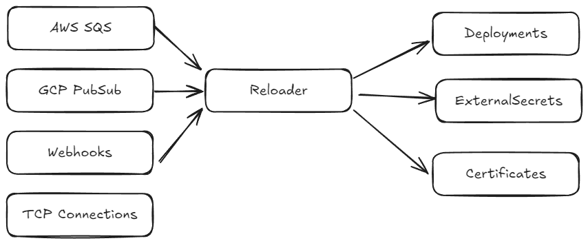

# External Secrets Reloader
External Secrets Reloader Allows you to trigger reloads dynamically to Resources in Cluster based on Events.



## Quickstart

Install from our release:
```
## Get Release
latest=$(curl -L https://api.github.com/repos/external-secrets-inc/reloader/releases/latest | jq -r .tag_name)
## apply manifest
curl -L https://github.com/external-secrets-inc/reloader/releases/download/$latest/bundle.yaml | kubectl apply -f -
```

Configure it to watch Secret Changes and Trigger Deployments:
```
apiVersion: reloader.external-secrets.io/v1alpha1
## Config is a Cluster Scoped resource for reloader configuration
kind: Config
metadata:
  name: reloader-sample
  labels:
    app.kubernetes.io/name: reloader
spec:
  notificationSources:
    - type: KubernetesSecret
      kubernetesSecret:
        ## Watch secrets internal to the cluster
        serverURL: https://kubernetes.default.svc
  destinationsToWatch:
    - type: Deployment
      deployment:
        labelSelectors:
          matchLabels: {}
```

Configure it to Watch over a SQS topic and trigger ExternalSecrets updates:
```
apiVersion: reloader.external-secrets.io/v1alpha1
kind: Config
metadata:
  name: gcp-sample
  labels:
    app.kubernetes.io/name: reloader
spec:
  notificationSources:
    - type: GooglePubSub
      googlePubSub: # see how to configure pubsub in https://docs.externalsecrets.com
        subscriptionID: sm-reloader
        projectID: my-gcp-sm-project
  destinationsToWatch:
  - externalSecret:
      labelSelectors:
        matchLabels: {}
```

## Documentation
Documentation is [hosted in here](https://docs.externalsecrets.com). We are currently working on a move so anyone can contribute to docs as well :smile:

## Contributing
 Anyone is free to come and contribute! Please note our [CLA](./CLA.md) and our [Code of Conduct](./CODE_OF_CONDUCT.md) before contributing.

 ## Community Meetings
 So far, we did not organize any community meetings. If you'd like to see one, [open a discussion](https://github.com/external-secrets-inc/reloader/discussions)!